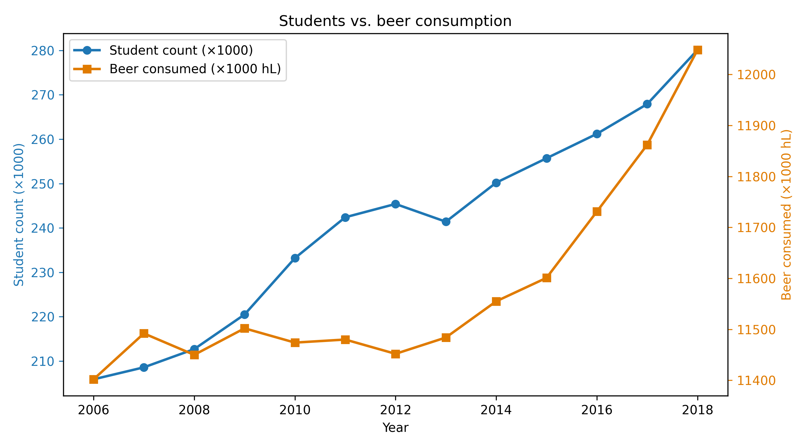

13326015

Van Dyke MCC, Thompson GR, Galgiani JN, Barker BM. The Rise of Coccidioides: Forces Against the Dust Devil Unleashed. Front Immunol. 2019 Sep 11;10:2188. doi: 10.3389/fimmu.2019.02188. PMID: 31572393; PMCID: PMC6749157.

Harvey, J.T., Culvenor, J., Payne, W., Cowley, S., Lawrance, M., Stuart, D. and Williams, R. (2002) ‘An analysis of the forces required to drag sheep over various surfaces’, Applied Ergonomics, 33(6), pp. 523–531. doi:10.1016/S0003-6870(02)00071-6.

Zeigler DW, Wang CC, Yoast RA, Dickinson BD, McCaffree MA, Robinowitz CB, Sterling ML; Council on Scientific Affairs, American Medical Association. The neurocognitive effects of alcohol on adolescents and college students. Prev Med. 2005 Jan;40(1):23-32. doi: 10.1016/j.ypmed.2004.04.044. PMID: 15530577.

students is in blue x1000, beer consumed in orange x1000 hL, the years are on the x-axis

I observe a rise in both the amount of students and the amount of beer consumed over the years. Both trajectories of these lines appear to be increasing with the years, which is indicative of a correlation. One can not be fully certain without an objective correlation analysis.